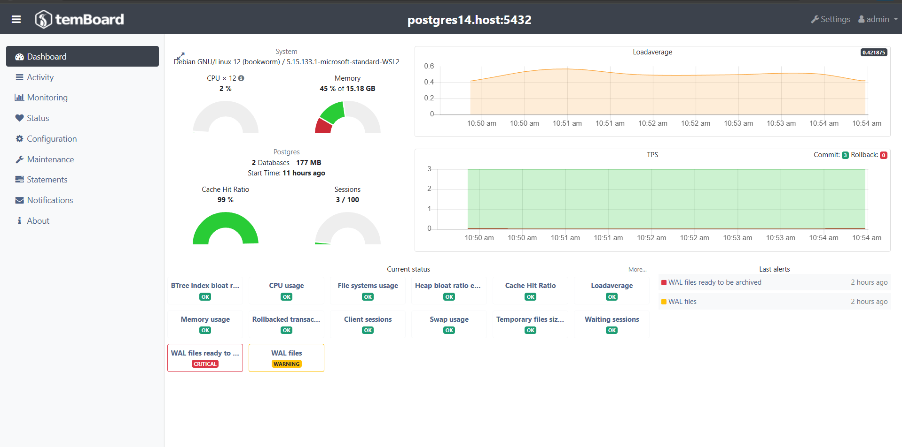

# 🚀 Temboard - Monitoramento do PostgreSQL

Este repositório contém a configuração do **Temboard** para monitoramento e administração do PostgreSQL. 📊

Nesse Readme, vamos detalhar os passos necessários para configurar e utilizar o Temboard em seu ambiente.



## 📋 Requisitos

- ✅ Temboard instalado no servidor de monitoramento.
- ✅ PostgreSQL instalado no servidor do Temboard.
- ✅ Acesso ao servidor PostgreSQL para leitura de informações.
- ✅ Biblioteca do temboard-agent instalado no servidor postgres que sera monitorado.

## 🛠️ Instalação do Temboard

Para começarmos a instalação do Temboard, é necessário configurar os seguintes componentes:

1. **Temboard Server**: O servidor que irá interagir com o PostgreSQL para coletar métricas e informações de desempenho.
2. **Temboard Agent**: O agente que será instalado no servidor PostgreSQL para enviar as informações para o Temboard Server.

### **Temboard Server**

Instale o Temboard Server em um servidor separado. Para isso, vamos configurar o [docker-compose.yml](../docker-compose.yml) do temboard:

``` bash
  temboard:
    build:
      context: ./temboard
      args:
        TEMBOARD_VERSION: "8.2.1"
    image: temboard:latest
    container_name: temboard
    volumes:
      - ssl:/etc/ssl/certs  
      - pgdata:/var/lib/postgresql/data
      - home:/home/temboard
      - ./temboard/config/temboard.conf:/home/temboard/temboard.conf:rw
    ports:
      - 3010:8888
      - 3110:5431
    depends_on:
      postgres:
        condition: service_healthy
    networks:
      postgres-network:
        ipv4_address: 100.100.0.30
```

Ao rodar o dockerfile, iremos baixar a versão 8.2.1 do temboards, configurando dentro dele as variaveis de ambiente do seu postgres interno, que será utilizado para armazenar as informações que serão monitoradas.

Dentro do seu `custom-entrypoint.sh` iremos iniciar o postgres e tambem configurar o ambiente do temboard, criando a extensão `pg_stat_statements` (caso não exista), que é usada para monitorar e coletar estatísticas sobre consultas SQL executadas no banco de dados. Além disso, executamos alguns comandos que geram as keys de segurança, que serão utilizadas pelo nosso container do postgres. 

Ao finalizado o custom-entrypoint, ele cria um arquivo, via touch, chamado *configured*, caso esse arquivo ja exista, o docker não executa novamente o comando, por existir uma validação de arquivo existente.

### **Temboard Agent**

Para instalarmos o agent no lado do container do postgres, possuimos a necessidade de ter o python rodando. Dentro do [dockerfile](../app/Dockerfile) do postgres, possuimos as seguintes linhas na qual vai intalar o python e configurar o temboard-agente de acordo com a versão instalada no lado do servidor:

```Dockerfile
  python3-pip python3-setuptools python3-dev; \
	whereis python3 && ln -s /usr/bin/python3 /usr/bin/python && \
	python3 -m pip install logutils argparse psycopg2 temboard-agent=="8.2.1" --break-system-packages && \
    rm -rf /var/lib/apt/lists/*
```

Dentro desse arquivo, tambem vamos ter variaveis de ambiente de configuração que apontam para o caminho do servidor para que haja a comunicação.

No seu custom-entrypoints, temos uma função chamada `runTemboardAgente`, que ao ser iniciar, ela cria a extensão(caso não exista) `pg_stat_statements` e ainda verifica se o temboard foi configurado a partir desse arquivo `temboard_configured`, caso não tenha sido configurado antes, vamos digitar o seguinte comando no nosso terminal local:

``` bash
bash init.sh configTemboardOnPostgres
```

Dentro desse arquivo `configTemboardOnPostgres`, iremos executar alguns comandos, no qual vamos buscar as keys geradas, no passo anterior, dentro do servidor do temboard e vamos iniciar o processo de monitoramento.

> **Aviso:**Essas etapas devem ser seguidas sempre que o container for zerado, caso tenha feito as configurações anteriormente e não tenha zerado os containers, não há a necessidade de executar os comandos.

## Arquivos de configuração de conexão

### **Temboard Server**

Dentro do servidor Temboard, possuímos dois arquivos de configuração principais: `postgresql.conf` e `temboard.conf`. Primeiro vamos detalhar as configurações presentes no arquivo **postgresql.conf**, que define o comportamento do servidor PostgreSQL.

**1. Configuração de Conexões**

```conf
max_connections = 50
```
- Define o número máximo de conexões simultâneas permitidas no servidor PostgreSQL. Se houver necessidade de mais conexões simultâneas, esse valor pode ser aumentado.

**2. Configurações de Memória**

```conf
shared_buffers = 256MB
effective_cache_size = 768MB
maintenance_work_mem = 128MB
work_mem = 1310kB
huge_pages = off
```
- **`shared_buffers`**: Define a quantidade de memória alocada para armazenar páginas do banco em cache. Geralmente, deve ser cerca de **25-40% da RAM disponível**.
- **`effective_cache_size`**: Estima a memória total disponível para cache de disco. Um valor maior melhora a performance de consultas.
- **`maintenance_work_mem`**: Memória utilizada por operações de manutenção, como **vacuum** e **reindex**.
- **`work_mem`**: Memória utilizada por consultas individuais para **ordenamento e hash join**.
- **`huge_pages`**: Define o uso de páginas de memória grandes. Se ativado, pode melhorar a performance em servidores de alto desempenho.

**3. Configuração de WAL (Write-Ahead Logging)**

```conf
checkpoint_completion_target = 0.9
wal_buffers = 7864kB
min_wal_size = 512MB
max_wal_size = 1GB
```
- **`checkpoint_completion_target`**: Ajusta a frequência de escrita de dados no disco. Valores altos reduzem impacto na performance.
- **`wal_buffers`**: Define a quantidade de memória dedicada ao WAL (Write-Ahead Log).
- **`min_wal_size`** e **`max_wal_size`**: Controlam o tamanho mínimo e máximo dos logs de transação, otimizando armazenamento e replicação.

**4. Configuração de Paralelismo**

```conf
max_worker_processes = 2
max_parallel_workers_per_gather = 2
max_parallel_workers = 2
max_parallel_maintenance_workers = 2
```
- Define o número máximo de **processos paralelos** utilizados em consultas SQL e operações de manutenção.

**5. Configuração de Logs e Monitoramento**

```conf
log_destination = 'stderr'
logging_collector = on
log_directory = '/var/lib/postgresql/data/log'
log_filename = 'postgresql.log'
log_min_messages = 'warning'
log_min_error_statement = 'error'
log_min_duration_statement = 0
log_duration = on
log_line_prefix = '%m [%p]: [%l-1] app=%a,db=%d,client=%h,user=%u'
log_lock_waits = on
log_statement = 'none'
log_timezone = 'America/Bahia'
```
- **`logging_collector`**: Ativa a coleta de logs do PostgreSQL.
- **`log_directory`** e **`log_filename`**: Definem onde os logs são armazenados.
- **`log_min_messages`** e **`log_min_error_statement`**: Controlam quais mensagens são registradas nos logs.
- **`log_statement`**: Controla quais comandos SQL são registrados. Definido como **`none`**, desativando o log de comandos SQL.

**6. Configuração do `pg_stat_statements`**

```conf
shared_preload_libraries = 'pg_stat_statements'
track_activity_query_size = 2048
track_io_timing = on
pg_stat_statements.track = all
```
- **`shared_preload_libraries`**: Ativa a extensão **pg_stat_statements**, que coleta estatísticas sobre queries executadas.
- **`track_activity_query_size`**: Define o tamanho máximo das consultas armazenadas no monitoramento.
- **`track_io_timing`**: Habilita a medição de tempos de I/O para análise de performance.
- **`pg_stat_statements.track`**: Configurado para **`all`**, garantindo o monitoramento de todas as consultas.

**7. Porta de Conexão**

```conf
port = 5431
```
- Define a **porta de conexão** do PostgreSQL como **5431**, diferente da padrão **5432**, essa configuração é bastante util para nos, pois levantamos postgres diferentes dentro do container.

---

Agora, iremos analisar o arquivo **temboard.conf**. Fizemos pequenas modificações  para rodar em cima do nosso serviço, mas ele se apresenta bem parecido como vem normalmente no sistema.

1.**[temboard]**

Essa sessão contém as configurações gerais do Temboard

- **port**: Define a porta onde o TemBoard vai escutar as conexões
- **address**: Define o endereço onde o TemBoard escutará.
- **cookie_secret**: Uma chave usado para criptografar cookies e garantir a segurança da aplicação.
- **home**: O diretório onde os arquivos do TemBoard são armazenados (configurado no Dockerfile).
- **plugins**: Especifica os plugins que o TemBoard irá carregar e usar. Os plugins configurados são:
  - **monitoring**: Para monitorar o estado do PostgreSQL.
  - **dashboard**: Para exibir informações gerais e visualizações no painel.
  - **pgconf**: Para modificar e gerenciar as configurações do PostgreSQL.
  - **activity**: Para visualizar atividades em tempo real no banco de dados.
  - **maintenance**: Para tarefas de manutenção, como reindexação, vacuums, etc.
  - **statements**: Para analisar e monitorar a execução de instruções SQL.

2.**[repository]**

Esta seção configura a conexão com o banco de dados que o TemBoard utiliza para armazenar suas informações. No nosso caso, utilizaremos um banco dentro do container do temboard, para não misturarmos as informações.

- **host**: O host onde o repositório de dados do TemBoard está localizado. Como vamos conectar no mesmo container, utilizamos o `localhost`
- **port**: A porta do banco de dados. Neste caso, a porta configurada é `5431`.
- **user**: O nome do usuário do banco de dados que o TemBoard usa para se conectar ao repositório. (Configurado nas variaveis de ambiente no Dockerfile, com o nome `POSTGRES_USER`)
- **password**: A senha do usuário para acessar o banco de dados. (Configurado nas variaveis de ambiente no Dockerfile, com o nome `POSTGRES_PASSWORD`)
- **dbname**: O nome do banco de dados utilizado pelo TemBoard.(Configurado nas variaveis de ambiente no Dockerfile, com o nome `POSTGRES_DB`)

3.**[logging]**

Essa seção configura como os logs do TemBoard serão registrados.

- **method**: Define o método de saída dos logs. 
  - **stderr**: Envia os logs para a saída de erro padrão, ou seja, no terminal ou arquivo de log do sistema.
  - **file**: Permite que os logs sejam gravados em um arquivo específico. (Necessário especificar o `destination`).
  - **syslog**: Envia os logs para o sistema de logs do sistema operacional.
- **level**: O nível de detalhes dos logs.
  - **INFO**: Registra informações gerais sobre o funcionamento do sistema.
  - **DEBUG**: Fornece informações detalhadas, úteis para diagnóstico e depuração.
  - **WARNING**: Indica situações que podem não ser ideais, mas não impedem o funcionamento do sistema.
  - **ERROR**: Registra erros que afetam o funcionamento do sistema, mas não causam falhas totais.
  - **CRITICAL**: Indica erros graves que podem comprometer o funcionamento do sistema.
- **destination**: O diretório onde os logs serão armazenados.

4.**[notifications]**

Esta seção permite configurar notificações, mas está vazia por não apresentar necessidade de envio de notificações nesse projeto.

Essa sessão pode ser usada para definir notificações de eventos, como falhas de conexão no banco, alerta de alto uso de recursos, ou outros tipos de avisos para os administradores.

5.**[monitoring]**

Aqui são feitas as configurações para o monitoramento do PostgreSQL.

- **purge_after**: Define o número de dias após os quais os dados de monitoramento serão excluídos.

6.**[statements]**

Esta seção é configurada para gerenciar o monitoramento de instruções SQL.

- **purge_after**: Define o número de dias após os quais os dados de execução de instruções SQL serão excluídos.

### **Temboard Agent**

Dentro do container do postgres, possuimos dois arquivos que utilizamos para configurar, `temboard-agent.conf` e o `postgresql.conf`. Ambos os arquivos serão explicados dentro do [README.md do postgres](../app/README.md)

# Acessando o Temboard

Ao passar pelos passos anteriores, tente acessar a url [http://localhost:3010](http://localhost:3010) no seu navegador. Caso não consiga acessar, verifique se o container esta rodando corretamente e volte para o passo [Arquivos de configuração de conexão](#arquivos-de-configuração-de-conexão)

Caso tenha sido sucessedido o acesso dentro da porta `3010`, vamos seguir os seguintes passos para fazer login e cadastrar nosso banco.

**1. Tela de login**: Vamos adicionar as credenciais padrões do Temboard
  - **Usuário**: admin
  - **Senha**: admin

**2.** Clique em Settings no canto superior direito e depois em new instance.

**3. Configurando instancia**:
  - Adicione o endereço do agente, que como esta no mesmo container, podemos utilizar o próprio nome do container `postgres`.
  - Seguindo a mesma lógica, vamos adicionar a porta de acesso do agente, que será, de acordo com o docker-compose `2345`.

**4.** Selecione groups default e os 6 plugins baixados.

**5.** Clique em register e comece a usar o monitorador.

# Links Importantes

Configuração do `temboard.conf` -> https://temboard.readthedocs.io/en/latest/server_configure


